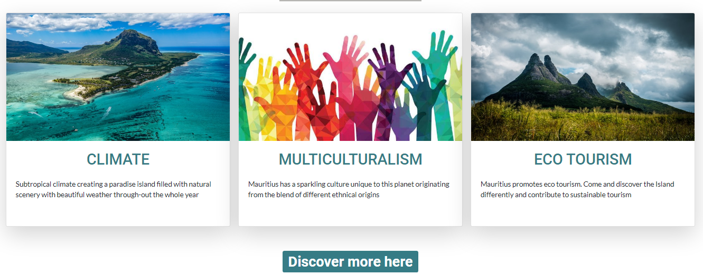
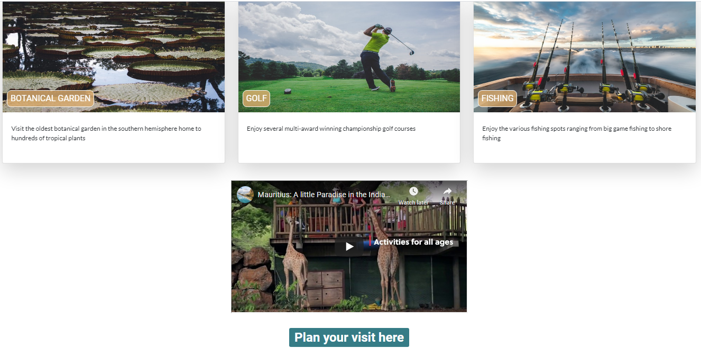

# **VISIT MAURITIUS**

The project was created with the main intention to promote tourism in Mauritius. 
Tourism being one of the main pillars of the Mauritian economy, my design was geared towards a website
that would reach a wide audience and show them different facets of tourism that Mauritius can offer instead 
of the traditional focus on beaches. Hence the site would be able to cater for tourists from a larger demographic 
group.

## UX

The website is mainly for those who are looking for a holiday destination.

* The user should be able to identify why they would want to visit Mauritius and why Mauritius is different from other
destinations.
* By visiting this site the users should be able to get an overview of what Mauritius can offer as a travel destination.

* The user should be exposed to other aspects of tourism besides beaches.

* The user should be able to easily identify whether Mauritius would meet their travel reqiurements.

* The user should be able to find detail about how to plan their trip.

The site layout was contructed using wireframe. Find the link [here](assets/doc/wireframe.pdf)

## FEATURES

All pages consist of the same header and footer layout. The header consists of collapse menu 
for smaller devices which links to the other pages.
The footer has social links plus an addtional link where visitors can download pdf form
on how to become a resident.

### *Home page*

The main landing page consists of a hero image showcasing the natural beauty of Mauriitus.
The page also highlights 3 main reasons to visit Mauritius using images a text. The user can then link to 
experiences page to further explore activities in more detail.

### *Experiences page*

This page has a layout of 9 main activities which can be done in Mauritius covering activities 
for all demographics. Image and text description used for the activities.

A short tourism video was embedded folowed by a link on how to plan your trip

### *Mauritius page*

A description of Mauritius for those wanting to gain more knowledge of Mauritius. Description 
taken from wikepedia.

### *Contact page*

This page is used if the user wants any further imformation by filling a contact form.

*Another feature idea*

In the future would like to add a weather widget to main hero image.

## Technologies Used

* HTML 
* css 
* official W3C validator
* css official validator (Jigsaw)
* chrome dev tools
* Bootstrap 4 was used to for page layout purposes to help in responsive design. 
* Bootstrap cards component was used for illustrating the activities available.

## TESTING

### Layout

The site layout has been designed to meet the website initial goals. Several image content were tested before finalising web pages. 

The layout design was such that the user would iniially see 3 main reasons to visit Mauritius on the main page with the intention 
of further wanting to explore the site.

The experiences page provided an easy and visual means to:
* showcase a variety activities that are on offer using both pictures and video.
* see if Mauritius suited their travel requirements.
* provide a link on how to plan their trip.

During testing it was noticed that on the Mauritius page the contrast between background image and text caused reading issues.
This was resolved by darking the background image.
### Navbar
- Page inspected on mobile devices using dev tool
- Toggle button pressed to inspect if dropdown menu is executed.
Under testing it was noticed that dropdown menu was behind the background images. Issue resolved using z-index and changing background colour
of dropdrown menu on smaller devices.
### Contact-form
- Go to the "Contact Us" page
- Submit query was pressed with empty fields. "Please fill out field" returned appears.
- Invalid email format inserted. Message related to invalid email format appears.
It was also noticed that contact form width was too small on smaller devices. This was modified using 
@media screen to increase width to 90%.
### Links 
All links were verified for errors.
Social links and download links initially changed active page when clicked on. Issue resolved by adding style="_blank" attribute.

The following validators were used to test for code errors:
* official W3C validator
* css official validator (Jigsaw)

## **DEPLOYMENT**

Gitpod was used used as online IDE and then pushed to GITHUB for [hosting](https://zahur76.github.io/MilestoneProject1/)

The Github page was deployed from the master branch.

## **CREDITS**

### *Content*
* The Mauritius history page description was taken from [wikipedia](https://en.wikipedia.org/wiki/Mauritius)
* The video used was from the official government youtube channel.

### *Media*
*	Photos were obtained from unsplash.com
*   logo design "Visit Mauritius" was obtained from textgiraffe.com
### *Acknowledgements*
* W3schools.com for reusing existing code referenced in css.
* geeksforgeeks.org for reusing existing code referenced in css.
* I received inspiration for this project from Shbana Meerun

